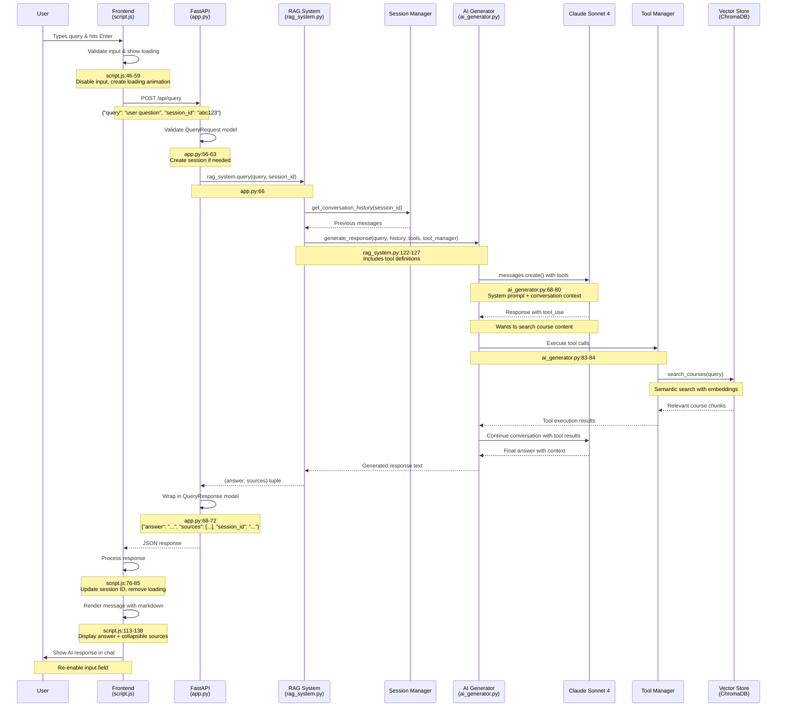

# RAG System Query Flow Diagram



## Key Components Flow

```
┌─────────────┐    ┌──────────────┐    ┌─────────────┐    ┌──────────────┐
│   Browser   │───▶│   FastAPI    │───▶│ RAG System  │───▶│ AI Generator │
│ (script.js) │    │   (app.py)   │    │(rag_system) │    │(ai_generator)│
└─────────────┘    └──────────────┘    └─────────────┘    └──────────────┘
       ▲                                        │                    │
       │                                        ▼                    ▼
       │                              ┌─────────────┐    ┌──────────────┐
       │                              │ Session Mgr │    │ Claude API   │
       │                              │   (history) │    │ (Sonnet 4)   │
       │                              └─────────────┘    └──────────────┘
       │                                                          │
       │            ┌─────────────────────────────────────────────┘
       │            │ Tool Use Request
       │            ▼
       │  ┌─────────────┐    ┌──────────────┐    ┌─────────────┐
       └──│Tool Manager │───▶│ Vector Store │───▶│  ChromaDB   │
          │ (CourseSearch) │    │ (semantic)   │    │ (embeddings)│
          └─────────────┘    └──────────────┘    └─────────────┘
```

## Data Flow Summary

1. **User Input** → `sendMessage()` in script.js:45
2. **HTTP Request** → POST `/api/query` with JSON payload
3. **API Handler** → `query_documents()` in app.py:56
4. **RAG Orchestration** → `rag_system.query()` in rag_system.py:102
5. **AI Generation** → Claude Sonnet 4 with tool access
6. **Tool Execution** → Vector search in ChromaDB when needed
7. **Response Assembly** → JSON with answer, sources, session_id
8. **Frontend Rendering** → Markdown parsing and UI update